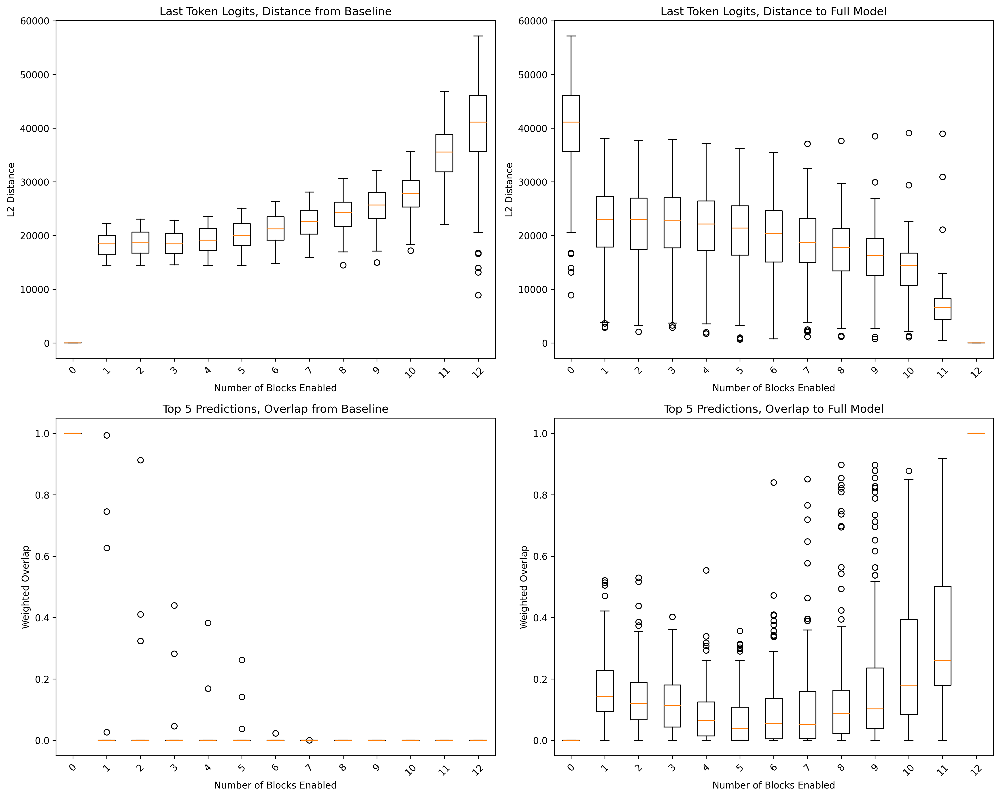

# Residual Stream Analysis: How GPT-2's Transformer Blocks Transform Predictions



## What We're Showing

This study analyzes how GPT-2's predictions change as transformer blocks are progressively enabled/disabled, revealing the internal "residual stream" (X-bus) dynamics.

## Methodology

- Progressive block masking (0-12 blocks) on 128 C4 calibration samples
- L2 distance analysis of logit (only the last token) distributions
- Weighted overlap analysis of top-5 predictions
- Box plots showing distribution across samples

## Files

- `main.py` - Main analysis script
- `models.py` - GPT-2 implementation with block masking
- `c4_calibration_texts.json` - Calibration dataset
- `c4_calibration_analysis.png` - Results visualization

## Usage

```bash
python main.py
```

## Insight

The first block is definitly very important. So are the last several layers.
